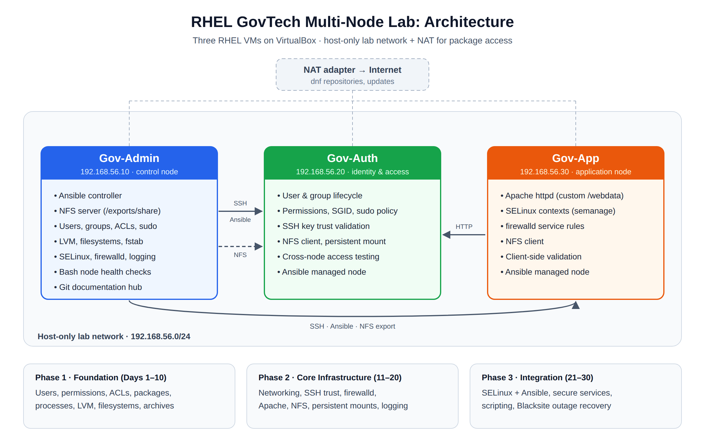

# RHEL GovTech Multi-Node Lab

A 30-day, three-node Red Hat Enterprise Linux lab modeled on how government and enterprise teams run Linux infrastructure. I built, deliberately broke, and repaired each service across three VMs, recording the **broken state, troubleshooting steps, fix, and verification** for every exercise.

Built alongside my RHCSA (RHEL 10) preparation, and now the base for my [IAM portfolio labs](https://github.com/Elijahtho2/iam-portfolio-labs) (FreeIPA, Ansible, Entra ID, HashiCorp Vault).



## Environment

| Node | IP | Role |
|---|---|---|
| **Gov-Admin** | 192.168.56.10 | Control node: Ansible controller, NFS server, user/storage administration, Git documentation |
| **Gov-Auth** | 192.168.56.20 | Identity and access: user lifecycle, permissions, SSH trust, NFS client |
| **Gov-App** | 192.168.56.30 | Application node: Apache httpd, SELinux contexts, firewalld, client-side validation |

- **Host-only network (192.168.56.0/24):** node-to-node traffic (SSH, Ansible, NFS, HTTP)
- **NAT adapter:** outbound access for `dnf` repositories and updates

Full design notes are in [architecture/README.md](architecture/README.md).

## Highlights

- **Multi-node services:** NFS exported from Gov-Admin and mounted persistently on the clients (`_netdev` in `/etc/fstab`, verified across a reboot); Apache on Gov-App reached from the other nodes through firewalld.
- **SELinux troubleshooting:** Apache serving from a custom `/webdata` directory returned **403 Forbidden** until I fixed the file context with `semanage fcontext` and `restorecon`, without disabling SELinux.
- **Automation:** Ansible from Gov-Admin to validate SELinux state, secure services, enforce user security policies, and schedule tasks, plus Bash scripts that run node health checks.
- **Blacksite final scenario (Day 30):** a simulated outage in which Apache, SELinux, and NFS all failed at once. I diagnosed and restored the environment with manual fixes and Ansible remediation.

## Lab Index

### Phase 1: Foundation (Days 1–10)

| Day | Topic | Docs |
|---|---|---|
| 1 | Users and groups administration | [Gov-Admin](phase-1-foundation/gov-admin/day-01/) · [Gov-Auth](phase-1-foundation/gov-auth/Day1/) |
| 2 | Permissions, ownership, and sudo | [Gov-Auth](phase-1-foundation/gov-auth/Day2/) |
| 3 | Shared directory (SGID), SSH, and ACLs | [Gov-Admin](phase-1-foundation/gov-admin/day-03/) · [Gov-Auth](phase-1-foundation/gov-auth/Day3/) |
| 4 | Package management (dnf) | [Gov-Admin](phase-1-foundation/gov-admin/day-04/) |
| 5 | Local storage: LVM creation and mounting | [Gov-Admin](phase-1-foundation/gov-admin/day-05/) |
| 6 | Process and system operations | [Gov-Admin](phase-1-foundation/gov-admin/day-06/) |
| 7 | LVM basics | [Gov-Admin](phase-1-foundation/gov-admin/day-07/) |
| 8 | File systems | [Gov-Admin](phase-1-foundation/gov-admin/day-08/) |
| 9 | Persistent storage | [Gov-Admin](phase-1-foundation/gov-admin/day-09/) |
| 10 | Archive and file management | [Gov-Admin](phase-1-foundation/gov-admin/day-10/) |

### Phase 2: Core Infrastructure (Days 11–20)

| Day | Topic | Docs |
|---|---|---|
| 11 | Networking basics (NAT + host-only) | [Gov-Admin](phase-2-core-infrastructure/gov-admin/day-11/) · [Gov-Auth](phase-2-core-infrastructure/gov-auth/day-11/) · [Gov-App](phase-2-core-infrastructure/gov-app/day-11/) |
| 12 | Host communication | [Gov-Admin](phase-2-core-infrastructure/gov-admin/day-12/) |
| 13 | SSH client and server | [Gov-Admin](phase-2-core-infrastructure/gov-admin/day-13/) |
| 14 | Multi-node SSH trust | [Gov-Admin](phase-2-core-infrastructure/gov-admin/day-14/) |
| 15 | firewalld | [Gov-Admin](phase-2-core-infrastructure/gov-admin/day-15/) |
| 16 | Apache HTTP server | [Gov-Admin](phase-2-core-infrastructure/gov-admin/day-16/) |
| 17 | Apache configuration and SELinux contexts | [Gov-App](phase-2-core-infrastructure/gov-app/day-17/) |
| 18 | NFS network storage | [Gov-Admin](phase-2-core-infrastructure/gov-admin/day-18/) |
| 19 | NFS persistent mount | [Gov-Auth](phase-2-core-infrastructure/gov-auth/day-19/) |
| 20 | System logging | [Gov-Admin](phase-2-core-infrastructure/gov-admin/day-20/) |

### Phase 3: Security and Integration (Days 21–30)

| Day | Topic | Docs |
|---|---|---|
| 21 | SELinux basics with Ansible validation | [Gov-Admin](phase-3-application-integration/gov-admin/day-21/) |
| 22 | SELinux contexts with Ansible | [Gov-Admin](phase-3-application-integration/gov-admin/day-22/) |
| 23 | SELinux troubleshooting with Ansible | [Gov-Admin](phase-3-application-integration/gov-admin/day-23/) |
| 24 | Secure services with Ansible | [Gov-Admin](phase-3-application-integration/gov-admin/day-24/) |
| 25 | User security policies with Ansible | [Gov-Admin](phase-3-application-integration/gov-admin/day-25/) |
| 26 | Scheduled tasks with Ansible | [Gov-Admin](phase-3-application-integration/gov-admin/day-26/) |
| 27 | Bash scripting basics | [Gov-Admin](phase-3-application-integration/gov-admin/day-27/) |
| 28 | Advanced Bash and node checks | [Gov-Admin](phase-3-application-integration/gov-admin/day-28/) |
| 29 | System integration | [Gov-Admin](phase-3-application-integration/gov-admin/day-29/) |
| 30 | **Blacksite final scenario:** multi-service outage and recovery | [Gov-Admin](phase-3-application-integration/gov-admin/day-30/) |

## How Each Day Is Documented

Each day's folder follows the same format:

- `README.md`: objective, machines used, the broken state I introduced, and the fix
- `commands.md`: commands run, in order
- `troubleshooting.md`: symptom, root cause, fix, verification
- `screenshots.md`: terminal evidence of the broken, fixed, and verified states

The documentation lives on the node where the work happened, so a day that ran on Gov-App is filed under `gov-app/`.

## Skills Demonstrated

RHEL 10 · users, groups, and ACLs · sudo policy · LVM and filesystems · persistent mounts · NFS · SSH key trust · firewalld · Apache httpd · SELinux (contexts, `semanage`, `restorecon`) · systemd · logging · Ansible · Bash · Git

## Repository Layout

```
architecture/                     design notes + diagram
ansible/                          Ansible control-node overview
phase-1-foundation/               Days 1–10
phase-2-core-infrastructure/      Days 11–20
phase-3-application-integration/  Days 21–30
scripts/                          screenshot import/sort helpers
docs/                             daily summaries
```

---

**Elijah Thomas** · RHCSA (RHEL 10) · CompTIA Security+ · [LinkedIn](https://linkedin.com/in/elijahthomas94)
